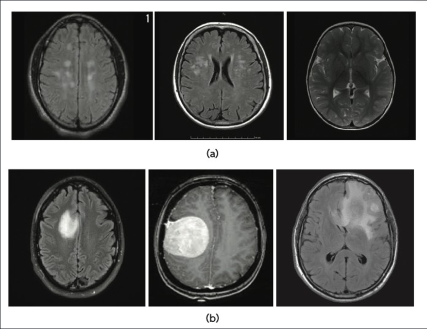
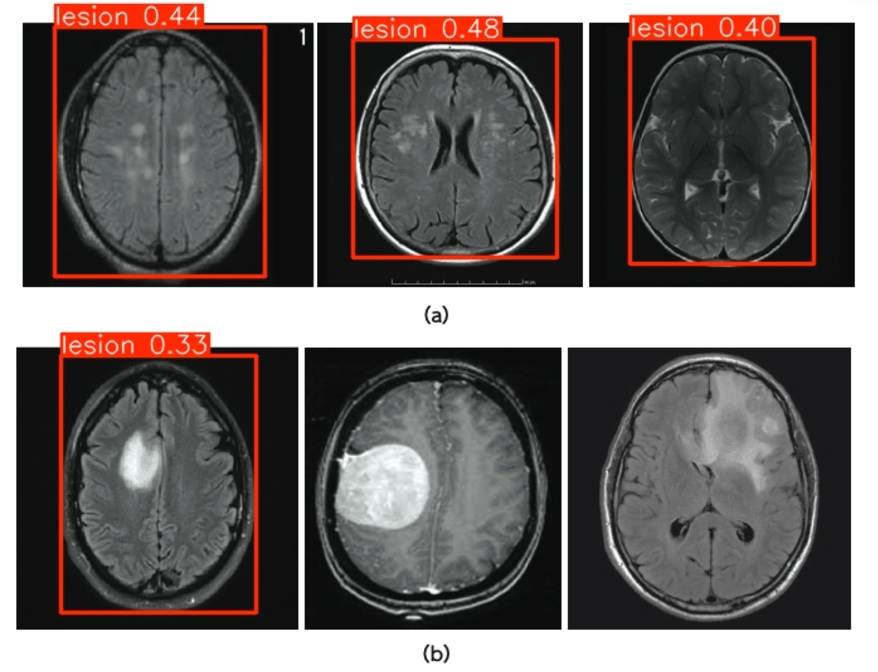

# Brain Tumor Detection with YOLO and Streamlit

This repository contains a Streamlit web application that uses a YOLO model to detect brain tumors from CT scan images. The model was trained using the YOLOv10 architecture and is designed to perform inference on uploaded images to identify potential tumor regions.

## Features
- Upload CT scan images and detect brain tumor regions using a YOLO model.
- Display the original and processed images with tumor detections highlighted.
- Provides detailed output on detected regions, including bounding boxes, labels, and confidence scores.

## Installation

To run this application, ensure you have Python installed. Follow these steps to set up the project:

1. Clone the repository:
    ```bash
    git clone https://github.com/SakshamAzad9/brain-tumor-detection-yolo-streamlit.git
    cd brain-tumor-detection-yolo-streamlit
    ```

2. Install the required packages:
    ```bash
    pip install -r requirements.txt
    ```

3. Download or place your YOLO model weights in the specified path (`C:\Users\saksh\Test1\runs\detect\train5\weights\best.pt`) or update the path in the code as needed.

## Usage

Run the Streamlit app with the following command:

```bash
streamlit run app.py
```
Once the server is running, you can open the provided local URL in your web browser to access the app.

How to Use
Upload a CT scan image in JPG or PNG format.
The app will display the original image and then run inference to detect any brain tumor regions.
The processed image with detection annotations will be displayed along with additional model output information.
Results
Below are sample detection results showing brain tumor detection on CT scans. The left image is the original upload, and the right image is the model's detection output.

##Result

```
| Original Image                         | Detection Result                      |
| -------------------------------------- | ------------------------------------- |
|  |  |
```


Folder Structure
```plaintext
.
├── app.py                  # Main Streamlit app
├── requirements.txt        # Required dependencies
├── README.md               # Project documentation
├── yolov10_weights         # Folder for model weights (update paths as needed)
└── results                 # Folder for sample result images

```
```Dependencies
streamlit
ultralytics
pillow
matplotlib
```
You can install all dependencies at once by using the requirements.txt file.

Model Training
This app uses a YOLO model trained on CT scan images for brain tumor detection. If you want to retrain the model, please refer to Ultralytics YOLO documentation for details on dataset preparation and model training.

Future Improvements
Extend support for batch image processing.
Add options for different YOLO model versions.
Improve visualization of detection details
